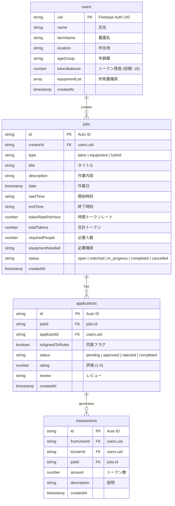

# 結 Yui - フル実装計画

農家向けタイムバンクアプリ「結 Yui」の完全実装計画。Next.js (App Router) + Firebase (Auth / Firestore) をベースに、時間通貨（労働力トークン）によるマッチングプラットフォームを構築する。

> [!IMPORTANT]
> プロジェクトディレクトリ `c:\Users\Ryuto Toyoda\Desktop\結` は現在空のため、ゼロからフルビルドする。前回の会話で設計済みのアーキテクチャ（Firestore スキーマ、UIデザイン方針）を踏襲する。

---

## Phase 0: プロジェクト初期化

### [NEW] Next.js プロジェクト

```bash
npx -y create-next-app@latest ./ --typescript --tailwind --eslint --app --src-dir --import-alias "@/*" --use-npm
npm install firebase lucide-react
```

### [NEW] `src/lib/firebase.ts`
Firebase 初期化モジュール（Auth, Firestore, Storage exports）

### [NEW] `.env.local.example`
環境変数テンプレート

### [NEW] `src/types/firestore.ts`
Firestore コレクション型定義（users, jobs, applications, transactions）

---

## Phase 1: 認証＆ウォレット

### [NEW] `src/contexts/AuthContext.tsx`
- Firebase Auth の状態管理（onAuthStateChanged）
- ログイン中ユーザーの Firestore ドキュメントもリアルタイム監視
- `useAuth()` フックを export

### [NEW] `src/app/login/page.tsx`
- ログイン / 新規登録の切り替え UI
- メール＋パスワード認証（Firebase Auth）
- 新規登録時に Firestore `users` ドキュメントを作成（初期トークン: 10）
- 大きなフォント、シンプルなフォーム

### [NEW] `src/app/wallet/page.tsx`
- トークン残高の大きな表示
- `transactions` を日付降順で取得して取引履歴リスト表示

### [NEW] `src/lib/firestore.ts`
- Firestore CRUD ヘルパー関数群
  - `createUser()`, `getUser()`, `updateTokenBalance()`
  - `createJob()`, `getJobs()`, `getJobsByUser()`
  - `createApplication()`, `getApplicationsByJob()`, `updateApplicationStatus()`
  - `createTransaction()`, `getTransactionsByUser()`

---

## Phase 2: 募集・応募・マッチング

### [NEW] `src/app/create/page.tsx` — 募集作成フォーム
- 3形式の選択（① 人のみ ② 機具のみ ③ 機具＋人）
- 入力項目: タイトル、日時、必要人数/機具、トークンレート、説明
- レート傾斜配分のプリセット（軽作業: 1、重労働: 1.5〜2、機具+人: 3〜5）
- Firestore `jobs` コレクションに保存

### [NEW] `src/app/explore/page.tsx` — 探す画面
- カレンダービュー: 月カレンダー上に募集数をバッジ表示、日付クリックでその日の募集一覧
- リストビュー: カードベースの募集一覧（タイプアイコン、トークン、日時表示）
- ビュー切り替えタブ

### [NEW] `src/app/explore/[id]/page.tsx` — 募集詳細＆応募
- ジョブ詳細情報表示
- 応募ボタン＋「相手の農園のやり方を尊重する」同意チェックボックス（必須）
- 応募 → Firestore `applications` に保存

### [NEW] `src/app/schedule/page.tsx` — 予定・管理
- 「進行中」タブ: 自分が作成した募集の応募者リスト（承認/却下ボタン付き）
- 「予定」タブ: 承認済みの自分の予定一覧
- 「履歴」タブ: 完了済みの作業履歴
- 完了報告ボタン → トークン自動移転

---

## Phase 3: ダッシュボード

### [MODIFY] `src/app/page.tsx` — ホーム画面
- トークン残高カード（大きく表示）
- 直近の予定カード（最大3件）
- おすすめヘルプ募集（ステータス「募集中」から最新3件）
- 各セクション「すべて見る」リンク

---

## Phase 4: プロフィール

### [NEW] `src/app/profile/page.tsx`
- 基本情報（名前、農園名、地域）
- 所有農機具リスト（追加/削除）
- ログアウトボタン

---

## Phase 5: 共通コンポーネント＆レイアウト

### [NEW] `src/components/Header.tsx`
- 左: 「結」ロゴ、右: トークン残高 🪙

### [NEW] `src/components/BottomNav.tsx`
- 5 タブ: ホーム / 探す / 募集 / 予定 / プロフィール
- Lucide Icons, アクティブ状態表示, ルーティング対応

### [MODIFY] `src/app/layout.tsx`
- AuthProvider ラップ
- 未ログイン時→ログイン画面リダイレクト
- ログイン時→ Header + BottomNav の共通レイアウト

### [MODIFY] `src/app/globals.css`
- カスタム CSS 変数（緑系カラーパレット）
- Noto Sans JP フォント
- モバイルファーストの基本スタイル

---

## デザイン方針

| 項目 | 仕様 |
|---|---|
| カラー | 自然の緑系グラデーション（`#2d5a27` → `#4ade80`）+ アースカラー |
| フォント | Noto Sans JP（Google Fonts） |
| ボタン | min-height 48px、角丸、大きいパディング |
| レイアウト | モバイルファースト、max-width 430px 中央寄せ |
| 文字サイズ | 本文 16px 以上、ラベル 14px 以上 |

---

## Firestore スキーマ



---

## Verification Plan

### ビルド確認

```bash
cd "c:\Users\Ryuto Toyoda\Desktop\結"
npm run build
```

Build が成功し、TypeScript エラーが 0 であることを確認する。

### ブラウザ検証（ブラウザサブエージェント使用）

```bash
cd "c:\Users\Ryuto Toyoda\Desktop\結"
npm run dev
```

開発サーバー起動後、ブラウザツールで `http://localhost:3000` にアクセスし、以下を視覚的に確認：

1. **ログイン画面**: フォーム表示、入力可能、スマホ幅で崩れない
2. **ホーム画面**: トークン残高、予定、おすすめ募集が表示
3. **探す画面**: カレンダー/リスト切り替え動作
4. **募集作成画面**: 3形式選択、フォーム入力
5. **ナビゲーション**: 全5タブの遷移確認
6. スクリーンショット取得・walkthrough に記録

> [!NOTE]
> Firebase は実 Firebase プロジェクトの設定がないためモック/デモデータで動作確認。認証はデモモード（ハードコードしたデモユーザー）で画面遷移を検証する。
